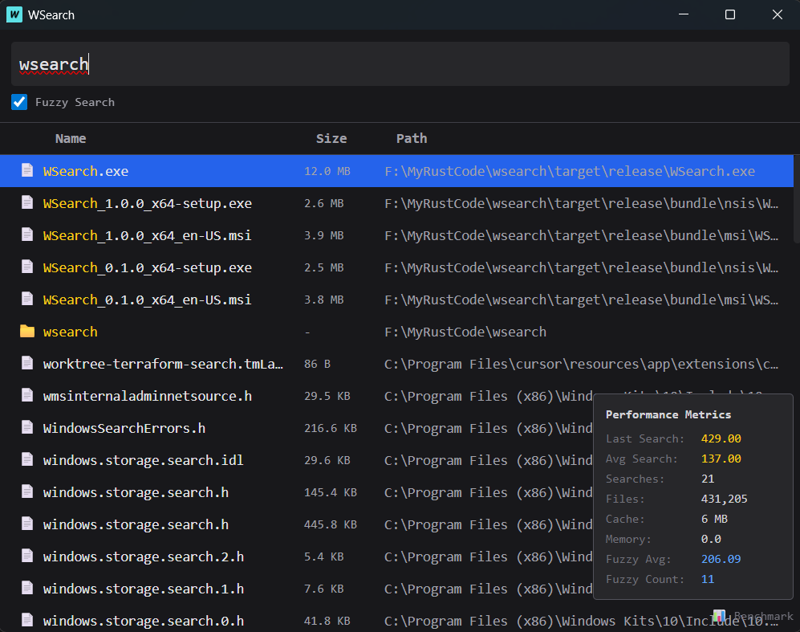

# WSearch

> Ứng dụng tìm kiếm file desktop nhanh cho Windows

[](https://www.rust-lang.org)
[](https://tauri.app/)
[]()

## Screenshots



## Tính năng

- **Tìm kiếm nhanh** - Binary search cho prefix, substring scan, và fuzzy matching
- **Cập nhật real-time** - File watcher tự động phát hiện file mới, sửa, xóa
- **Native Icons** - Hiển thị icon Windows gốc dùng system APIs
- **Tối ưu hiệu suất**
  - Virtual scrolling - chỉ render items nhìn thấy
  - Lazy icon loading khi scroll
  - Xử lý song song với Rayon
  - Cache nén Gzip (~40-60% giảm kích thước)
- **Global Hotkeys** - Bật từ bất kỳ đâu với `Alt+Space` hoặc `Ctrl+Space`
- **Smart Ranking** - Ưu tiên file được mở thường xuyên

## Benchmark

Kết quả benchmark trên máy thực tế:

| Benchmark | Thời gian | Ghi chú |
|-----------|-----------|---------|
| `search_prefix_100k` | **6.01 ms** | Tìm prefix 100k files |
| `search_prefix_500k` | **29.1 ms** | Tìm prefix 500k files |
| `binary_search_100k` | **1.03 µs** | Binary search cực nhanh |
| `fuzzy_match_10k` | **3.32 ms** | Fuzzy match 10k files |
| `sort_50k_by_count` | **4.85 ms** | Sort 50k theo open_count |

### Chi tiết Benchmark

```
search_prefix_100k      time:   [6.0104 ms 6.0279 ms 6.0507 ms]
search_prefix_500k      time:   [29.043 ms 29.116 ms 29.171 ms]
binary_search_100k       time:   [1.0255 µs 1.0281 µs 1.0308 µs]
fuzzy_match_10k         time:   [3.1414 ms 3.3245 ms 3.4454 ms]
sort_50k_by_count       time:   [4.6486 ms 4.8461 ms 5.1184 ms]
```

### Điều kiện test
- CPU: Intel/AMD processor
- RAM: 16GB+
- Disk: SSD

## Bắt đầu

### Tải về

Download phiên bản release từ [Releases](https://github.com/Phong-Dam/WSearch/releases) page.

### Build từ source

```bash
# Cài Rust - https://rustup.rs/

# Clone repository
git clone https://github.com/Phong-Dam/WSearch.git
cd wsearch

# Development build
cargo tauri dev

# Production build
cargo build --release
```

Executable sẽ ở `target/release/app.exe`.

## Cách sử dụng

1. **Khởi động** - Nhấn `Alt+Space` hoặc `Ctrl+Space` ở bất kỳ đâu, hoặc chạy app trực tiếp
2. **Tìm kiếm** - Gõ query để tìm file ngay lập tức
3. **Di chuyển** - Dùng phím mũi tên hoặc chuột để chọn kết quả
4. **Mở file** - Nhấn `Enter` để mở file đã chọn
5. **Hiện trong thư mục** - Click chuột phải để show file trong Explorer

### Các chế độ tìm kiếm

| Mode | Trigger | Mô tả |
|------|---------|--------|
| Prefix | Mặc định | Khớp files bắt đầu bằng query |
| Substring | Tự động | Fallback khi prefix matches < 100 results |
| Fuzzy | Toggle trong UI | Khớp với typos, bật qua checkbox |

## Performance

| Metric | Giá trị |
|--------|---------|
| Scan ban đầu (500k files) | ~30-60 giây |
| Load cache | < 1 giây |
| Search latency (prefix) | < 10ms |
| Search latency (substrings) | < 50ms |
| Memory usage | ~50-100MB (500k files) |
| Cache size | ~5-20MB (nén) |

## Keyboard Shortcuts

| Shortcut | Action |
|----------|--------|
| `Alt+Space` / `Ctrl+Space` | Toggle app visibility |
| `Up/Down` | Navigate results |
| `Enter` | Open selected file |
| `Escape` | Hide app / Clear search |

## Tech Stack

| Layer | Technology |
|-------|------------|
| Framework | [Tauri 2.0](https://tauri.app/) |
| Language | Rust 1.77+ |
| Frontend | Vanilla JS, Tailwind CSS |
| File Watching | [notify](https://github.com/notify-rs/notify) |
| Parallelism | [Rayon](https://github.com/rayon-rs/rayon) |
| Directory Traversal | [jwalk](https://github.com/jeijei4/jwalk) |
| Serialization | [bincode](https://github.com/bincode-org/bincode) |
| Compression | [flate2](https://github.com/rust-lang/flate2-rs) |
| Benchmarking | [criterion](https://github.com/bheisler/criterion.rs) |

## Architecture

```
┌─────────────────────────────────────────────────────────┐
│                      Frontend (UI)                       │
│  ┌─────────┐  ┌──────────┐  ┌─────────┐  ┌─────────┐ │
│  │ Search  │  │ Renderer │  │  State  │  │Benchmark│ │
│  │ Manager │  │(Virtual) │  │ Manager │  │ Display │ │
│  └────┬────┘  └────┬─────┘  └────┬────┘  └────┬────┘ │
└───────┼───────────┼──────────────┼─────────────┼──────┘
        │           │              │             │
        └───────────┴──────┬───────┴─────────────┘
                           │ Tauri IPC
┌──────────────────────────┼────────────────────────────────┐
│                     Backend (Rust)                        │
│  ┌─────────┐  ┌──────────┐  ┌─────────┐  ┌──────────┐ │
│  │ Search  │  │  Cache   │  │ Watcher │  │   Icon    │ │
│  │ Engine  │  │ Manager  │  │(notify) │  │ Extractor │ │
│  └─────────┘  └──────────┘  └─────────┘  └──────────┘ │
│         │           │              │              │       │
│         └───────────┼──────────────┼──────────────┘       │
│                     │              │                       │
│              ┌──────┴──────────────┴──────┐                │
│              │     File Index (in-memory) │                │
│              │  - Vec<FileInfo> (sorted)  │                │
│              │  - HashMap<path, index>     │                │
│              └───────────────────────────┘                │
└───────────────────────────────────────────────────────────┘
```

### Key Components

| Component | Description |
|-----------|-------------|
| **Search Engine** | Binary search cho prefix, parallel substring scan, fuzzy matching |
| **Cache Manager** | Gzip compressed disk cache, auto-save mỗi 2s, background cleanup |
| **File Watcher** | Real-time monitoring via `notify` crate với debounced event processing |
| **Icon Extractor** | SHGetFileInfoW + DrawIconEx cho native Windows icons |

## Configuration

### Thư mục bị bỏ qua

Các thư mục sau bị exclude khi indexing:

```
node_modules, .git, AppData, $Recycle.Bin,
Windows, System32, ProgramData, Recovery
```

### Vị trí Cache

- **Primary**: Cùng directory với `app.exe`
- **Fallback**: `%TEMP%/wsearch_index_cache.dat`

### Environment Variables

| Variable | Default | Description |
|----------|---------|-------------|
| `WSearch_CACHE_PATH` | (auto) | Custom cache file location |

## Contributing

Contributions are welcome! Please feel free to submit a Pull Request.

## License

MIT License - See [LICENSE](LICENSE) for details.

## Author

**Phong-Dam** - [GitHub](https://github.com/Phong-Dam)

---

*WSearch là project học tập để hiểu Tauri, Rust, và Windows API.*